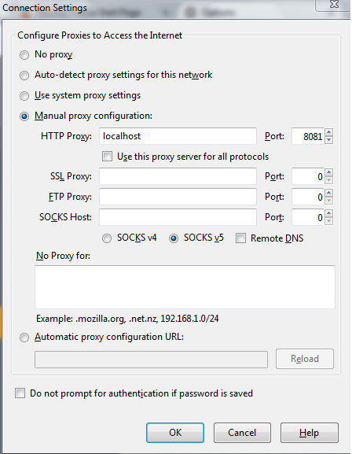

# Web_Proxy_Server

# Objective
To understand how web proxy server works

Python 3.4 version is used to code proxy.py
Packages used are:
1.	socket
2.	_thread
3.	re
4.	sys	

# Instructions to use proxy.py
1.	Change network settings in browser as shown in below figure. 

2.	In command prompt run the following command
python proxy.py
3.	Try website like www.google.com or www.facebook.com to test proxy.py
4.	Observe log file to see HTTP messages.

# References:
1.	https://docs.python.org/3.4/howto/sockets.html
2.	http://stackoverflow.com/questions/12454675/whats-the-return-value-of-socket-accept-in-python
3.	https://docs.python.org/3.1/library/_thread.html

